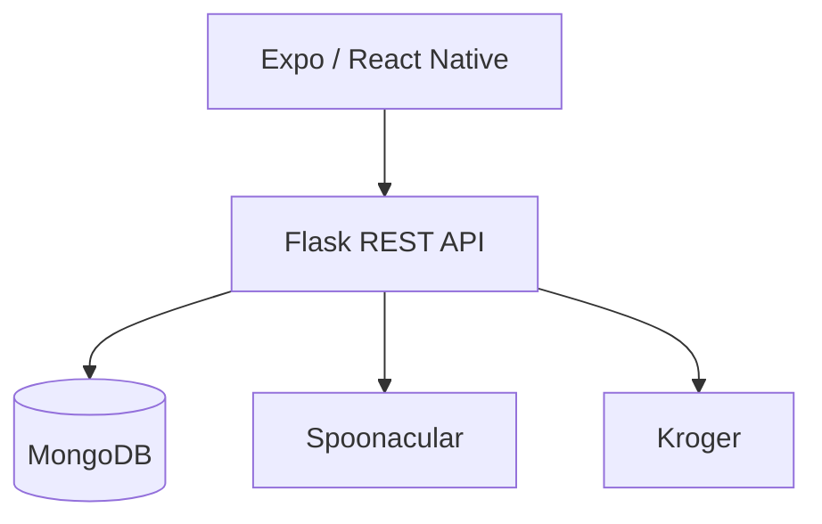

# SmartCart Mobile App

SmartCart is an academic mobile grocery and recipe-planning application built by a four-person capstone team over approximately four months. It helps users discover recipes, apply dietary preferences, save favorites, and organize grocery shopping.

This repository preserves the Expo and React Native client used for the capstone project. The companion Flask API is in [SmartCart-Backend](https://github.com/shreyakembhavi/SmartCart-Backend).

> **Project status:** Capstone prototype. The team demonstrated the application through Expo Go; it is not currently deployed or production-hardened.

## Product experience

- Account registration, login, and email-based two-factor verification
- Recipe discovery, search, details, ingredients, and instructions
- Dietary restrictions, allergies, cuisines, and nutrition preferences
- Locally saved recipes and shopping-cart state
- Grocery search, checkout, and order-history flows
- Mobile navigation and reusable recipe components

The broader team prototype also included Quick Pick Cart, an OCR-assisted grocery-list workflow. It is identified as a team feature rather than an individual contribution.

## Architecture



The client uses Expo Router for file-based routes, AsyncStorage for authentication and local application state, and protected REST requests for user-specific backend features.

## Recommendation work

The companion backend contains the embeddings-based recommendation work developed for SmartCart. It creates a taste profile from saved-recipe titles, filters candidates using user preferences, and ranks them with cosine similarity.

This approach does **not** use an SVM. The recommendation work is documented as part of the broader capstone system; this repository remains close to the mobile client snapshot used by the team rather than rewriting its original flows after the project ended.

## My contributions

My work focused on product direction, personalization, and the mobile experience:

- Designed and implemented the OpenAI embeddings-based recommendation approach
- Built the saved-recipes experience and preference/filter workflows
- Designed and refined UI/UX across authentication, dashboard, recipes, profile, and navigation
- Integrated frontend screens with REST APIs and persisted application state
- Tested and fixed routing, state-management, AsyncStorage, and data-persistence issues
- Served as Scrum Master for two month-long sprints, coordinating sprint planning, documentation, feature integration, and team collaboration

## Technology

- Expo 53 and React Native
- TypeScript and React 19
- Expo Router and React Navigation
- AsyncStorage and Expo SQLite
- Flask and MongoDB companion backend
- Spoonacular and Kroger integrations through the backend
- OpenAI embeddings in the companion recommendation service

## Run locally

### Prerequisites

- Node.js 20 or newer
- npm
- Expo Go, an emulator, or a native development environment
- A running [SmartCart backend](https://github.com/shreyakembhavi/SmartCart-Backend)

### Installation

```bash
git clone https://github.com/shreyakembhavi/SmartCart-Frontend.git
cd SmartCart-Frontend/SmartCart

npm install
cp .env.example .env
npm start
```

Set `EXPO_PUBLIC_API_URL` in `.env` to the backend address.

For an emulator on the same computer, `http://localhost:5000` may be sufficient. A physical phone running Expo Go generally needs the computer's LAN address, for example:

```env
EXPO_PUBLIC_API_URL=http://192.168.1.25:5000
```

The original capstone used a hardcoded development-machine address. Environment configuration replaces only that machine-specific value; it does not change the API endpoints or feature logic.

## Available scripts

| Command | Purpose |
| --- | --- |
| `npm start` | Start the Expo development server |
| `npm run android` | Run the Android native project |
| `npm run ios` | Run the iOS native project |
| `npm run web` | Start the web target |
| `npm run lint` | Run Expo linting |
| `npm test` | Run Jest in watch mode |

## Repository structure

| Path | Purpose |
| --- | --- |
| `SmartCart/app` | Expo Router screens and flows |
| `SmartCart/app/(tabs)` | Primary mobile tabs |
| `SmartCart/app/components` | Recipe, cart, filter, and order components |
| `SmartCart/assets` | Fonts and application images |
| `SmartCart/android`, `SmartCart/ios` | Native application projects |
| `SmartCart/app.config.js` | Environment-aware Expo configuration |

## Prototype limitations

- The app requires external API credentials configured in the backend.
- Some state, including saved recipes and cart contents, remains device-local in this frontend snapshot.
- Authentication tokens are stored in AsyncStorage for the prototype; production use should adopt secure platform storage.
- Automated test coverage is limited.
- Additional accessibility review, offline behavior, observability, and deployment hardening would be needed for production.
