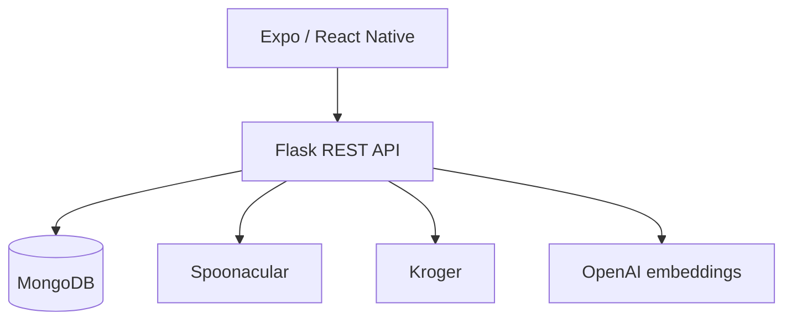

# SmartCart Mobile App

SmartCart is an academic mobile grocery and recipe-planning application built by a four-person capstone team over approximately four months. It helps users discover recipes, save favorites, personalize suggestions, and turn meal ideas into a shopping workflow.

This repository contains the Expo and React Native client. The companion Flask API is in [SmartCart-Backend](https://github.com/shreyakembhavi/SmartCart-Backend).

> **Project status:** Capstone prototype. The team demonstrated the application through Expo Go; it is not currently deployed or production-hardened.

## Product experience

- Account registration, login, and email-based two-factor verification
- Recipe discovery, search, details, ingredients, and instructions
- Dietary restrictions, allergies, cuisines, and nutrition preferences
- Saved recipes synchronized with the backend
- Personalized recipe ranking based on saved-recipe embeddings
- Grocery search, cart management, checkout, and order history
- Responsive mobile navigation and reusable recipe components

The broader team prototype also included Quick Pick Cart, an OCR-assisted grocery-list workflow. It is identified as a team feature rather than an individual contribution.

## Architecture



The client uses Expo Router for file-based routes, AsyncStorage for the authentication token and local cart state, and protected REST requests for user-specific data.

## Personalized recommendations

SmartCart combines explicit preferences with saved-recipe behavior:

1. The user selects diets, intolerances, cuisines, and nutrition goals.
2. Saved recipes are persisted to the backend.
3. The backend embeds saved-recipe titles and averages them into a taste profile.
4. Candidate recipes are filtered through Spoonacular.
5. Cosine similarity ranks candidates against the taste profile.
6. The home screen displays the highest-ranking suggestions.

This is an embeddings-based recommendation engine. It does **not** use an SVM.

## My contributions

My work focused on product direction, personalization, and the mobile experience:

- Designed and implemented the OpenAI embeddings-based recommendation approach
- Built the saved-recipes experience and its backend synchronization
- Built the preferences and filtering experience for diets, allergies, cuisines, and nutrition goals
- Designed and refined UI/UX across authentication, dashboard, recipes, profile, and navigation
- Integrated frontend screens with REST APIs and persisted application state
- Tested and fixed routing, state-management, AsyncStorage, and data-persistence issues
- Served as Scrum Master for two month-long sprints, coordinating sprint planning, documentation, integration, and team collaboration

## Technology

- Expo 53 and React Native
- TypeScript and React 19
- Expo Router
- React Navigation
- AsyncStorage
- Expo SQLite
- Flask and MongoDB companion backend
- Spoonacular, Kroger, and OpenAI integrations through the backend

## Run locally

### Prerequisites

- Node.js 20 or newer
- npm
- Expo Go, an emulator, or a native development environment
- A running [SmartCart backend](https://github.com/shreyakembhavi/SmartCart-Backend)

### Installation

```bash
git clone https://github.com/shreyakembhavi/SmartCart-Frontend.git
cd SmartCart-Frontend/SmartCart

npm install
cp .env.example .env
npm start
```

Set `EXPO_PUBLIC_API_URL` in `.env` to the backend address.

For an emulator on the same computer, `http://localhost:5000` may be sufficient. A physical phone running Expo Go generally needs the computer's LAN address, for example:

```env
EXPO_PUBLIC_API_URL=http://192.168.1.25:5000
```

Do not commit local environment files.

## Available scripts

| Command | Purpose |
| --- | --- |
| `npm start` | Start the Expo development server |
| `npm run android` | Run the Android native project |
| `npm run ios` | Run the iOS native project |
| `npm run web` | Start the web target |
| `npm run lint` | Run Expo linting |
| `npm test` | Run Jest in watch mode |

## Repository structure

| Path | Purpose |
| --- | --- |
| `SmartCart/app` | Expo Router screens and flows |
| `SmartCart/app/(tabs)` | Primary mobile tabs |
| `SmartCart/app/components` | Recipe, cart, filter, and order components |
| `SmartCart/assets` | Fonts and application images |
| `SmartCart/android`, `SmartCart/ios` | Generated native projects |
| `SmartCart/app.config.js` | Environment-aware Expo configuration |

## Prototype limitations

- The app requires external API credentials configured in the backend.
- Recommendations currently use recipe-title embeddings and are generated on demand.
- Authentication tokens are stored in AsyncStorage for the prototype; production use should adopt secure platform storage.
- Cart state remains partly device-local.
- Automated test coverage is limited.
- Additional accessibility review, offline behavior, rate limiting, observability, and deployment hardening would be needed for production.
